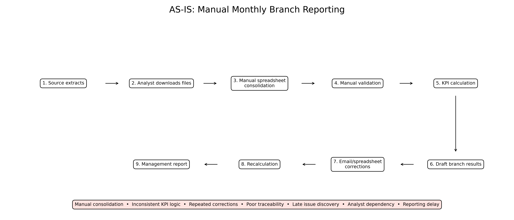
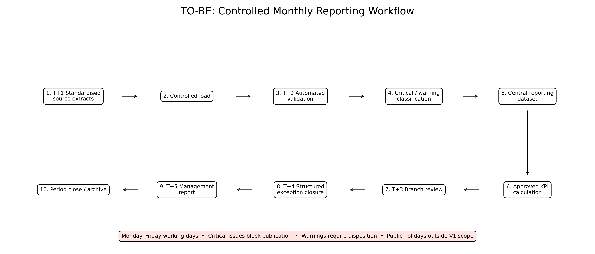
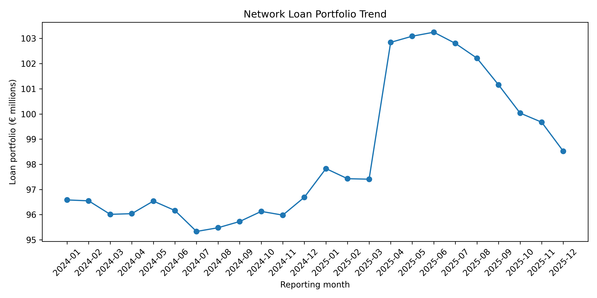
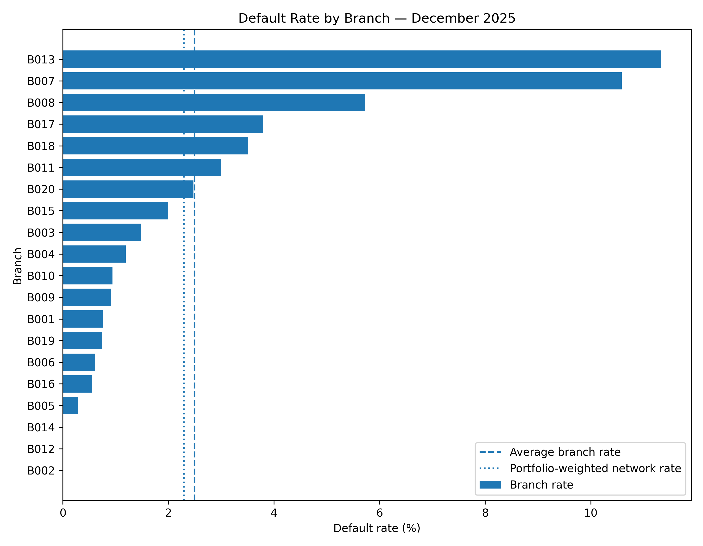

# NovaBank Monthly Reporting Transformation

**Business Analysis, Requirements Engineering & SQL Reporting Case**

This project translates a fictional retail-bank reporting problem into a controlled monthly workflow, relational data model, tested SQL calculations, and management-ready outputs.

## Business Problem

NovaBank's monthly branch-reporting process is too manual to consistently deliver timely, traceable and comparable performance information to retail management. Separate extracts, spreadsheet consolidation, informal corrections, and inconsistent KPI definitions create rework and make results difficult to audit.

## Project Objective

Design and demonstrate a realistic V1 process that standardises inputs, validates data before review, calculates approved KPIs centrally, separates critical failures from management warnings, and retains a traceable adjustment and publication decision.

## Business Analysis Approach

```text
Business problem → stakeholder needs → AS-IS process → requirements
→ KPI definitions → relational model → validation → SQL reporting
→ testing → TO-BE process → management recommendations
```

The primary user is the Head of Retail Banking / Retail Management. Branch Managers are secondary report users, while Reporting Analysts operate the process. Finance / Controlling, Data / IT, and Data Owners support definition, delivery, and issue resolution.

## AS-IS vs TO-BE





The proposed working-day sequence is T+1 source extracts, T+2 validation, T+3 branch review, T+4 correction closure, and T+5 management reporting. Weekends are excluded; public-holiday calendars are outside V1 scope. A concise comparison is available in [docs/as_is_to_be_comparison.md](docs/as_is_to_be_comparison.md).

## Requirements and Traceability

The case distinguishes business requirements (the outcome needed), functional requirements (system behaviour), and non-functional requirements (measurable quality or operational constraints). User stories express needs from a user perspective; acceptance criteria and test cases provide measurable evidence. Traceability is demonstrated in the implemented chain from approved KPI and validation rules to SQL, named regression tests, and generated evidence files.

## Banking Reporting Model

The source-like model contains 20 fictional branches, 5,000 customers, 7,000 logical accounts, 1,500 logical loans, customer-period branch assignments, and 136,436 transactions across 24 month-end reporting periods. Control tables hold validation issues, reporting adjustments, and cycle status. `monthly_branch_kpis` is the derived reporting table. The executable schema is in [sql/schema.sql](sql/schema.sql).

## KPIs

Seven branch-performance KPIs are implemented:

- Active Customers
- New Customers
- Deposit Volume
- Loan Portfolio
- Default Rate
- Transaction Count
- Month-over-Month Loan Growth

Data Quality Exception Rate is a separate process-control measure. Management Warning Rate is also reported separately and does not redefine warnings as data failures.

## SQL and Implementation

The project uses SQLite and readable SQL with `JOIN`, `GROUP BY`, `CASE`, common table expressions, `LAG()`, and `RANK()`. Calculations use full precision; presentation rounding is applied only in management communication. Ranking is called **KPI value rank**, because a higher value is not always better.

## Data Validation

**Data-quality failures** are critical structural or integrity problems. Six deliberately invalid synthetic fixtures are validated before loading, and the resulting issue records are created by the validation logic. The constrained accepted tables contain zero foreign-key violations and zero accepted-data critical findings.

**Management warnings** flag unusual KPI results for review. They do not automatically block publication, trigger correction, or imply an error. Publication readiness still requires warning disposition, while unresolved critical issues set the separate publication-blocking flag.

## Requirement Refinement During Testing

The original New Customers warning used only absolute month-over-month movement above 20%. Testing produced 147 warnings because small changes such as 1 → 2 equal +100%. The refined rule requires movement above 20% **and** an absolute change of at least 5 customers, reducing the result to 3 warnings. This is a requirements-learning example, not a coding defect. See [docs/requirements_refinement.md](docs/requirements_refinement.md).

## Key Results

In the synthetic scenario:

- 3,360 branch-period-KPI rows are produced with the approved seven definitions.
- December 2025 has 4,560 Active Customers, €66.483 million Deposit Volume, €98.521 million Loan Portfolio, and 5,166 eligible posted transactions.
- The December portfolio-weighted network Default Rate is 2.3%; network loan growth is -1.2% month over month.
- 33 management-warning issues affect 32 of 2,800 assessed results, a 1.1429% warning rate.
- Six rejected critical fixtures among 448,575 checked records produce a 0.0013% Data Quality Exception Rate; accepted constrained tables have no critical findings.
- All 13 Checkpoint 5 regression tests pass and deterministic generation is verified.

These values illustrate the reporting model and are not real banking findings.

## Management Reporting





The management layer contains a network overview, branch comparison, exception/commentary view, and approved adjustment example in [management/reporting_prototype.md](management/reporting_prototype.md).

## Limitations

- NovaBank is fictional and all data is synthetic.
- Warning thresholds are fictional management rules.
- Products and processes are simplified.
- No real customer data or regulatory reporting is used.
- This is a reproducible analytical prototype, not a production implementation.
- Power BI and public-holiday calendars are outside V1 scope.

## Repository Structure

```text
novabank-reporting-ba-case/
├── data/
│   ├── synthetic_raw/       # reproducible generated CSV files (Git-excluded)
│   └── processed/           # lightweight evidence; SQLite DB is Git-excluded
├── docs/                    # comparison, data dictionary, rules, injections
├── figures/                 # management charts
├── management/              # prototype views and management summary
├── process/                 # AS-IS and TO-BE diagrams
├── sql/                     # schema, KPI, validation, adjustment, queries
├── src/                     # deterministic generator and reporting scripts
├── README.md
└── requirements.txt
```

The 51 MB SQLite database and 25 MB generated source CSV directory are excluded from Git because both are reproducible. Lightweight CSV evidence and public figures remain available for review.

## Reproduction

Python 3.9 or later is recommended.

```bash
python3 -m venv .venv
source .venv/bin/activate
python -m pip install -r requirements.txt
python src/generate_synthetic_data.py --verify-repeatability
python src/run_checkpoint5.py
python src/create_management_outputs.py
```

The first command generates and loads the constrained SQLite database. The second calculates KPIs, runs validation and tests, applies the controlled demonstration adjustment, and creates evidence files. The third creates management tables, figures, and process maps.

## Skills Demonstrated

- Business Analysis and Requirements Engineering
- Process Mapping and Requirements Traceability
- SQL, KPI Reporting, and Data Validation
- Management Communication
